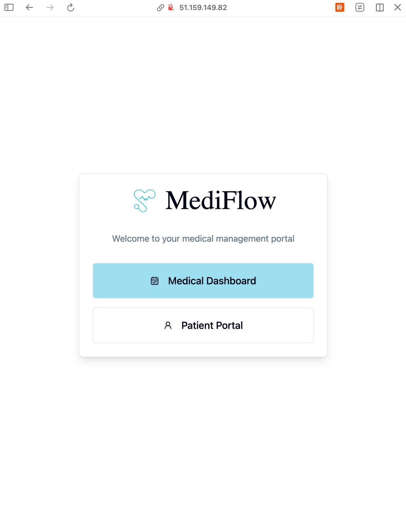
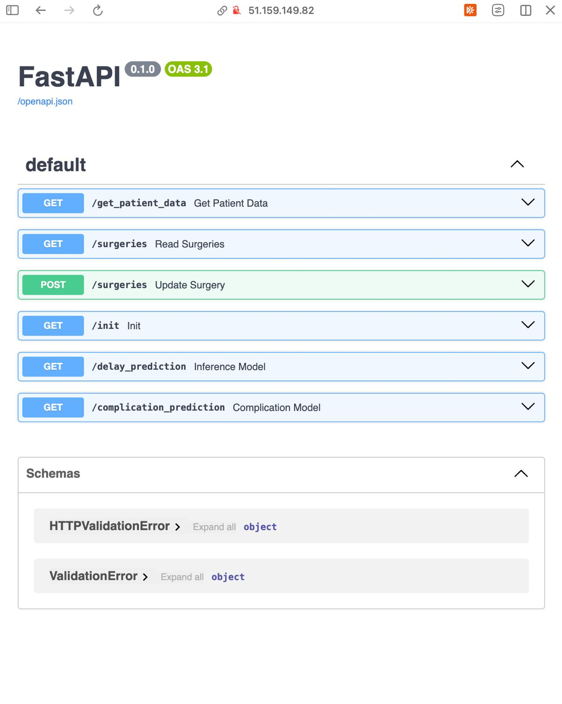
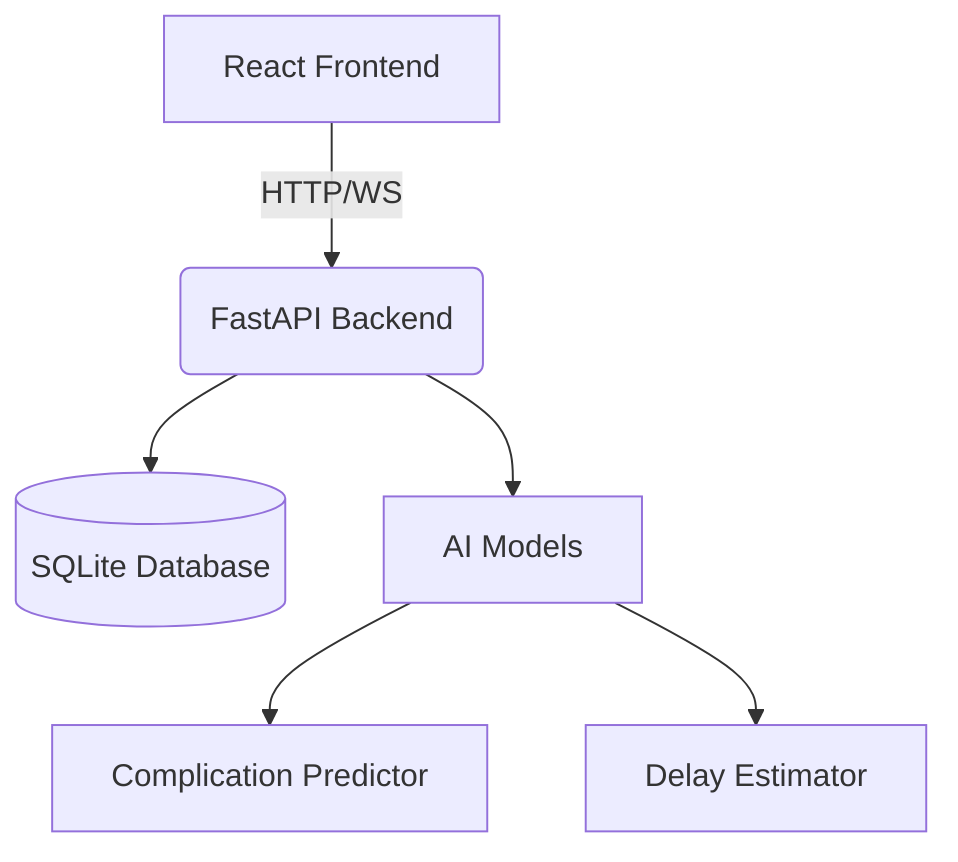
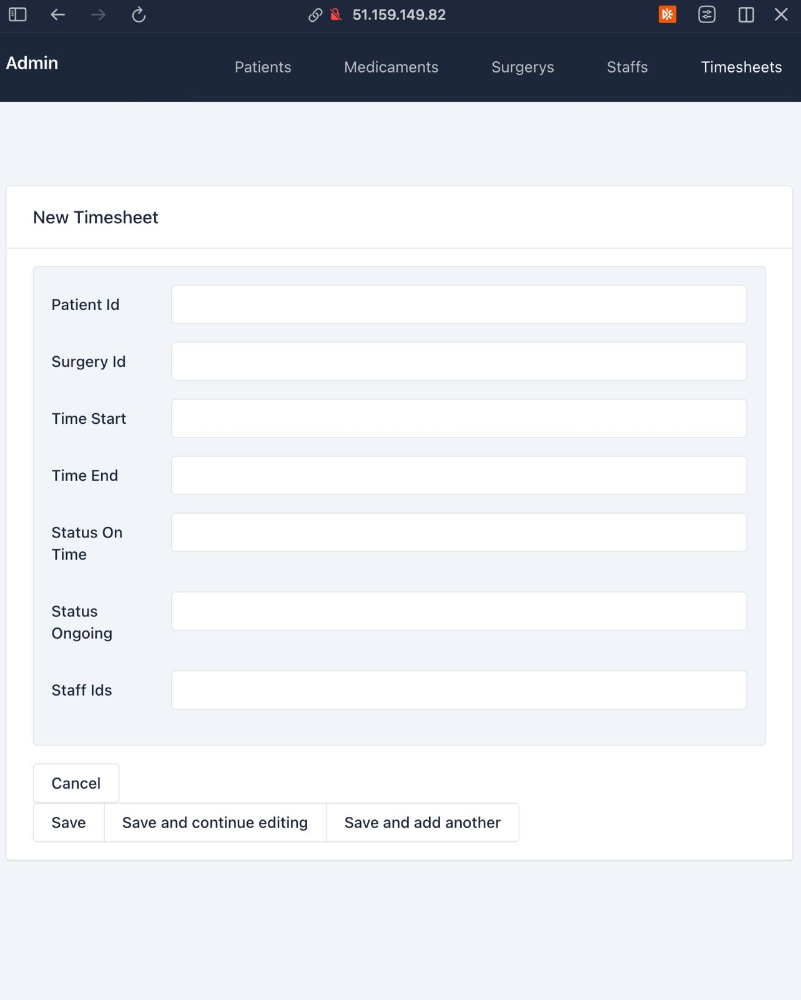
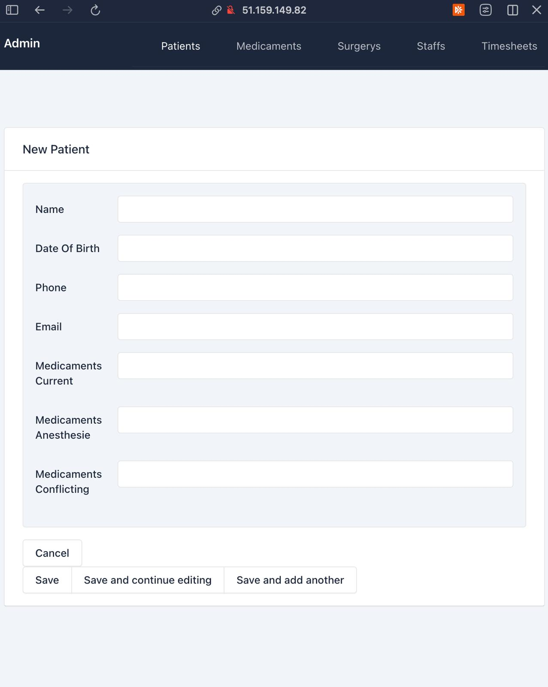

# 🏥 MediFlow: Streamlined Surgery Management System [](https://opensource.org/licenses/MIT) [](https://github.com/sofiahuppertz/MediFlow/pulls)

🌟 A portal between hospitals and patient. A platform optimizing surgical workflows with AI-powered predictions and real-time coordination

## 📑 Table of Contents
- [Landing Page](#landing-page)
- [✨ Key Features](#-key-features)
- [🛠️ Tech Stack](#-tech-stack)
- [📂 Repository Structure](#-repository-structure)
- [🚀 Getting Started](#-getting-started)
  - [Prerequisites](#prerequisites)
  - [Installation](#installation)
  - [Development](#development)
- [🔍 Usage Guide](#-usage-guide)
- [⚙️ System Architecture](#-system-architecture)
- [💾 Our DB](#-our-db)
- [📈 AI Performance](#-ai-performance)
- [📝 Roadmap](#-roadmap)
- [🤝 Contributing](#-contributing)
- [📄 License](#-license)

## Landing Page


## ✨ Key Features
- 🕒 **Real-Time Surgical Timeline** with delays and emergencies anticipated
- 🔔 **Smart Notifications** for schedule changes and surgery preparation
- 🧠 **AI Prediction Engine**  
  - `92% accuracy` post-anesthesia complication detection
  - `30% buffer` anesthesia duration forecasting
- 👨⚕️ **Dual Portal System**  
  - Doctor's control panel
  - Patient surgery
- 📱 **Mobile-First Design** for hospital tablet use

## 🛠️ Tech Stack
**Backend**  
 


**Frontend**  


**Infrastructure**  





## 📂 Repository Structure
```
.
├── backend/
│ ├── functions/            # AI inference modules
│ ├── routers/              # API endpoints & WebSockets
│ ├── database.py           # Database configuration
│ └── main.py               # FastAPI entry point
├── frontend/
│ ├── src/                  # React components
│ ├── Dockerfile            # Frontend container config
│ └── vite.config.ts        # Build configuration
└── docker-compose.yml      # Full-stack orchestration
```

## 🚀 Getting Started

### Prerequisites
- Docker 20.10+
- Python 3.10+
- Node.js 18+

### Installation
```
git clone https://github.com/sofiahuppertz/MediFlow
cd MediFlow
docker-compose up --build
```

**Access Points**  
- Frontend: `http://localhost:3000`  
- Backend API: `http://localhost:8000`  
- API Docs: `http://localhost:8000/docs`

### Development

**Backend Setup**
```
cd backend
pip install -r requirements.txt
uvicorn main:app --reload
```

**Frontend Setup**
```
cd frontend
npm install
npm run dev
```

## 🔍 Usage Guide
1. **Schedule Management**
   - Interface to plan surgeries, delay them or add an emergency
   - Real-time conflict detection between surgeries

2. **Patient Portal**
   - Pre-op instructions delivery (fasting, drinking and medication times )
   - Surgery status updates (delays both ways hospital <--> patient)

3. **AI Integration**
   - Automatic risk scoring
   - Delay prediction alerts

[Watch a live interaction](https://youtu.be/rkofe1Z-Ptg)

## ⚙️ System Architecture


## 💾 Our DB

### A few of our variables





## 📈 AI Performance
| Metric                  | Value | Confidence Interval |
|-------------------------|-------|----------------------|
| Complication Recall     | 86%   | ±2.1%               |
| Anesthesia Time Buffer  | +30%  | ±4.3%               |

## 📝 Roadmap
- [ ] 📱 Patient Mobile App Features:
  - [ ] Fasting Reminders
  - [ ] Anxiety Assessment
  - [ ] Delay Reporting
- [ ] 💊 Medication Interaction Checker

## 📄 License
Distributed under MIT License. See `LICENSE` for details.
